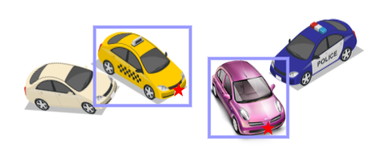
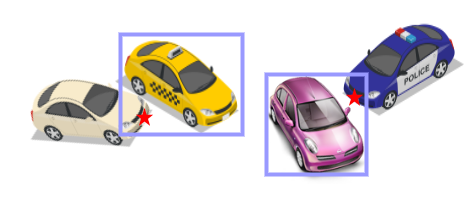
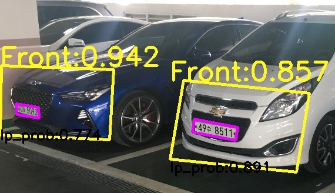

# 1. Introduction
Object detection has a noticeable evolution after deep learning appeared and aided object de-tection. After 2013, the Pascal VOC object detection  challenge has been dominated by deep learning-based methods. Followed by this trend, many application fields related to object de-tection are also benefited. Robot vision, monitoring system (e.g., face detection), self-driving car (e.g., pedestrian detection), and our main research topic, license plate detection, all catch up with the trend and are all further improving due to the aid of deep learning.

This chapter will introduce the origin of license plate recognition (1.1) followed by re-cent improvements made by deep learning (1.2), challenges that will often be met in the task of license plate recognition and thus became our motivation (1.3), the main contribution and the disposal of the thesis (1.4 & 1.5).  

## 1.1.	Automatic License Plate Recognition (ALPR)
Automatic License Plate Recognition (ALPR) is a process of finding and recognizing the li-cense plates. ALPR, as a substantial task in our daily life, has been widely used in the fields like parking lot toll control and traffic scene condition analysis. ALPR divides into four sub-tasks, image acquisition, license plate detection, license plate segmentation, and Optical Character Recognition (OCR). 

Image acquisition task relates to the obtaining process of an image targeted to do ALPR, like a traffic condition monitoring system, a surveillance system, or simple cameras. License plate detection task is to locate the license plate position inside an image, features of a license plate like boundary, texture, color, and character inside the license plate can all be a potential role for locating a license plate. License plate segmentation task relates to separating the characters inside the license plate and thus can do the OCR with more ease. This process can be done by handling pixel connectivity, projection profiles, prior knowledge of characters, and character contours [1]. The final task, optical character recognition, will receive the segmentation results and recognize the characters. Template matching, Support Vector Ma-chine (SVM), and neural networks deal with OCR tasks in the decades.

## 1.2.	The Aid of Deep Learning
Since the classic ALPR pipeline is divided into four sub-tasks, the optimization process is quite tricky as each of the processes links to and counts on each other. An overall and end-to-end optimization strategy is needed if we want to push the performance of ALPR to another level. 

Recently, deep learning technics aid the ALPR a lot especially with the help of Convolu-tional Neural Network (CNN). Silva and Jung [2] proposed a network named WPOD-NET (Warped Planar Object Detection Network), their method is to find a license plate inside a single vehicle using CNN, with obtaining not only rectangle bounding boxes, but also paral-lelograms after the model learned the affine transform parameters and applied to rectangle bounding boxes, their model can transform the license plate back into the rectangle easily by inverse affine transform and further do the OCR. 

Silva and Jung [3] designed a single network handling both license plate segmentation and OCR at the same time and leads to a possibility of end-to-end optimization for segmenta-tion and character recognition.
 
## 1.3.	Challenges
In the license plate detection stage, most existing systems are based on the frontal view of license plates. The open-source version of commercial software OpenALPR, it struggles to find the license plate with transformation, like a tilted license plate or the license plate which belongs to the car in an oblique view. This problem states a critical performance bottleneck for ALPR since the license plate detection failure means the total inability to comprehend a spe-cific license plate. 

The method proposed by Silva and Jung [2] aimed to detect the license plate in a more general way, their model first detects cars inside an image and further finds the license plates for those cars, this improved the ability to find tilted license plates in pictures, as the high ac-curacy car detection has been developed recently. Their method highly reduced the detection missing (false-negative cases) of the license plate, but the drawback exists, within the pictures with multiple cars inside, their model might regress to a license plate which doesn’t belong to the vehicle and cause a loss of contextual information between the vehicle and the license plate, Figure 1.1 shows the potential problem and Figure 1.2 gives a real example.
Here, we conclude two problems of license plate detection we would like to solve:
1.Lack of detection ability for tilted and oblique license plates.
2.Loss of contextual information while dealing with more general license plate detec-tion.

Figure 1.1. Examples of desired (upper) and undesired (lower) arrangement of license plates based on vehicle detection method, the license plate detection results are marked in stars.

Figure 1.2. A real case of detection missing. The license plate of the left car has been re-gressed to the wrong license plate which belongs to the car on the right side.
 
## 1.4.	Contributions
As mentioned in section 1.1, there are four sub-tasks in the ALPR process, our research fo-cuses on the license plate detection task, aiming to accurately locate the license plate in vari-ous scenes with single or multiple vehicles inside. As to maintain the contextual information when dealing with higher license plate detection performance, the owner car of the license plate will be detected as well, the pose of the car, on which side (front or rear) does the license plate lay on will also be classified. Figure 1.3 shows a detection example, the license plate detection missing problem mentioned in the last section can be solved by our proposed method.

Figure 1.3. Detection result of our method. The two license plates are all found precisely.

We conclude our main contributions as followed:
1.We designed a CNN-based network for detecting license plates’ vertices with a va-riety of angles in real-world scenes.
2.Along with license plate detection, vehicle’s pose information will also be given. Our model will detect and classify the region of the car’s front part and the rear part where a license plate is onto.
3.To train our model, we proposed a new dataset with manually annotated front-rear bounding boxes. We described the dataset detailedly in section 4.1.2.
4.The detecting process is based on a novel anchor-free method (3.1), no manually decided anchor-box size is needed; it might be an inspiration for other object de-tecting applications. 

## 1.5.	Thesis Outline
Followed by Chapter 1, Chapter 2 will introduce the background knowledge related to our work, including the recent object detectors proposed in literature until 2019 (2.1), the back-bone architecture designed for object detection (2.2), a loss function for adjusting the weight between difficult learning case and easy learning case (2.3), and a post-processing technic of-ten used for eliminating duplicate detection results (2.4).

Chapter 3 gives a full understanding of our proposed method, including the whole model design (3.1), the optimization strategy with loss function design and detail training label en-coding implementation (3.2), and training tricks with explanation of the reasons why we ap-plied them in the training process (3.3).

Chapter 4 presents the performance of our model, with the dataset used for training and validation (4.1), quantitative mAP (mean Average Precision) analysis and qualitative results (4.2), followed by the discussion of how the detection ability of our model differed during the training process (4.3). Chapter 5 will then be a wrap and conclude our work.
