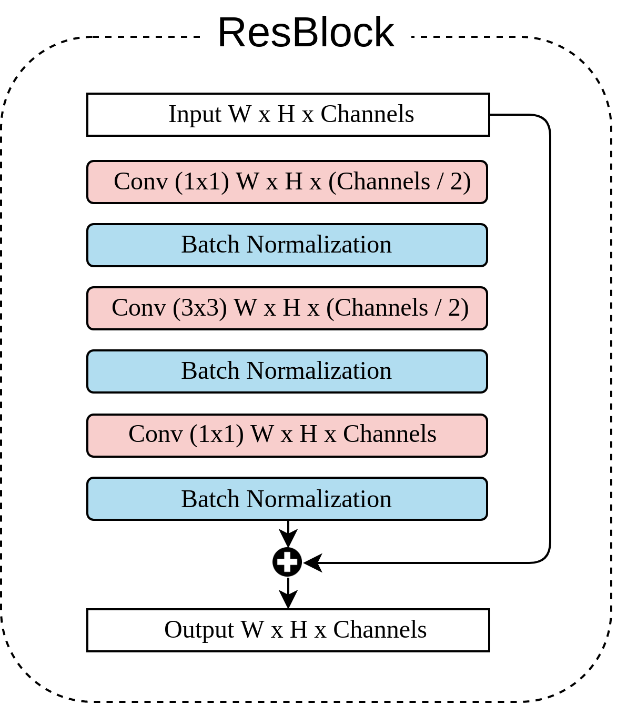
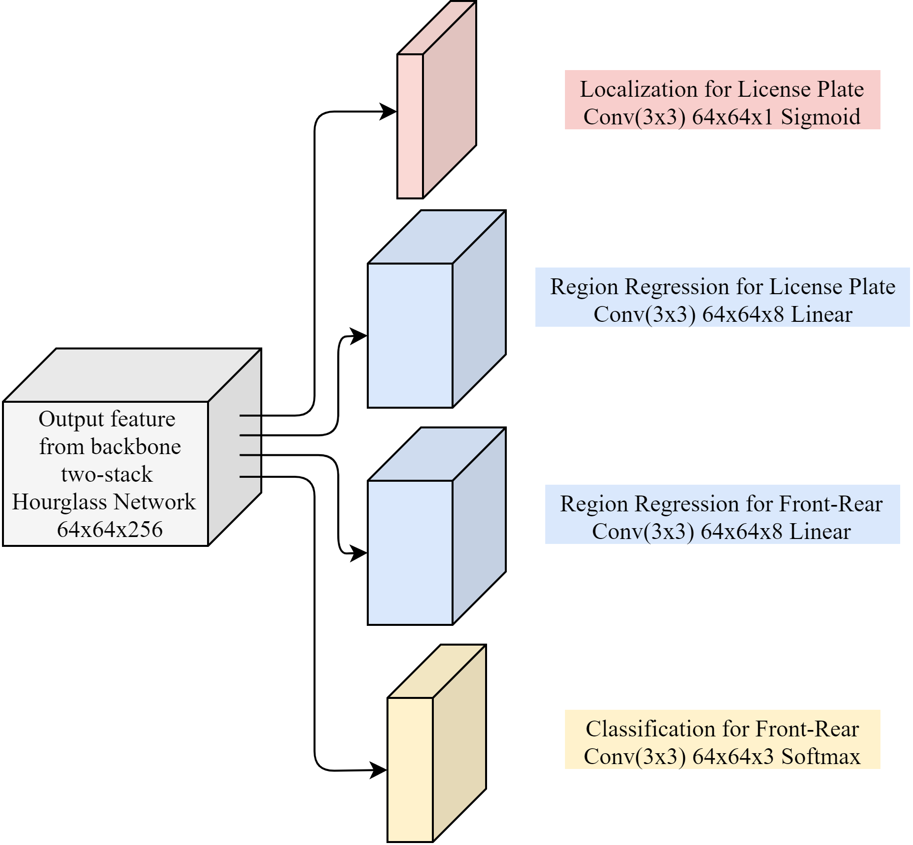
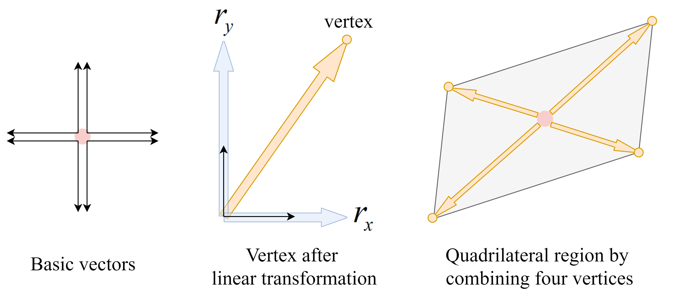
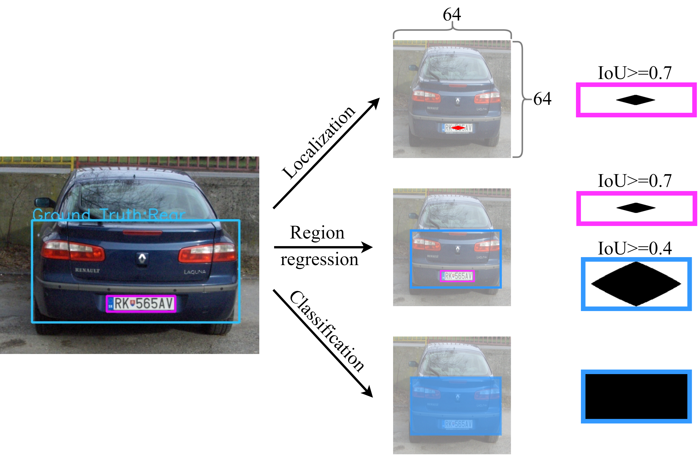

# 3. Method
As mentioned in section 1.3, there are mainly two issues we would like to tackle, now we list the corresponding methods and works for each problem and their relevant sections:
1.	Lack of detection ability for tilted and oblique license plates.
To make our model able to locate the license plate accurately, we need a strong feature extraction backbone, and a proper design for indicating the license plates with diverse transformations under different scenarios (3.1). The loss function designed for optimizing with back-propagation is described in section 3.2.
2.	Loss of contextual information while dealing with more general license plate detec-tion.
Contextual information is defined as the relationship between the vehicle and the license plate in our work. For obtaining the vehicle’s pose information when a license plate is detected, our method is to find the front part and rear part of a vehicle, with the infor-mation of car’s front and rear, we can obtain the contextual information more precisely as discussed in section 1.4. As we will demonstrate in section 3.1, our model can receive either ground-truth bounding quadrilaterals or bounding rectangles as our training data while not limit to only bounding rectangles training, and it is due to our anchor-free de-sign for finding four vertices of RoI individually, the corresponding method for optimiz-ing such a design is mentioned in section 3.2.
In the last section (3.3) of this chapter, we give a view of the training method we applied dur-ing our training, including the data augmentation and the training strategy refined at times by observing the learning condition of our model.
## 3.1.	Model Design - VerNeX
The proposed model is called VerNeX (A Net with object’s VerteX information). VerNeX is a one-stage and anchor-free detector. The whole model is shown in Figure 3.1. The width and height of an input RGB image will be first downscaled to   and pass through two stacks of Hourglass Network, until here is the backbone feature extraction part. By utilizing the ob-tained features, three parallel heads will then handle localization, region regression, and clas-sification individually. The right side of Figure 3.1 gives an output example of our model, we can see that the license plate region has been found, and the front-rear region of the owner car is also given along with its pose information.
	This section includes the backbone feature extraction network design, and the head net-work architecture with its function and design inspiration, which is done in one-stage manner. The last part of this section will be a brief discussion for anchor-free method.

Figure 3.1. The whole pipeline of our model.
 
### 3.1.1.	Backbone Network Design
As discussed in section 2.1.1, a one-stage detector has a trade-off between speed and perfor-mance, and the performance will descend significantly especially for small objects. License plates, in general situations, are small objects (imaging the scale difference between license plates and vehicles), so the feature extraction ability of the backbone network architecture becomes considerable, the spatial information needs to be fruitful to avoid missing detections for small objects. Inspired by the adoption of Hourglass Network in recent one-stage detectors [15] [25], we introduced Hourglass Network as our backbone architecture and found it per-formed much better than a normal straight forward CNN, a comparison between their perfor-mance can be found in Appendix B.
	The network design is given in Figure 3.2, our training input size is fixed in  , after two down-sampling processes (a convolution layer and a max-pooling layer with stride 2), the image with its scale of   width and height will then be fed into a two-stack Hour-glass Network. The layers in Figure 3.2 without special mention are all ReLU activation function, and the layers in trapezoids are down-sampled or up-sampled processes by a factor of 2.
	The right side of Figure 3.2 is the architecture of a single Hourglass Network, the ResBlock (Residual block) architecture is shown in Figure 3.3. After passing through the first Hourglass Network, following the original design of stacked Hourglass Network [19], we add two parallel CNN branches with linear activation functions and do the element-wise addi-tion with the features before feeding into Hourglass Network in a residual manner. The fea-ture map after performing element-wise addition will then pass through another Hourglass Network with the same architecture and yield a final output with size  .

Figure 3.2. Backbone network. A two-stack Hourglass Network.
 

Figure 3.3. Residual block.
### 3.1.2.	Head Network Design
Beyond the backbone network, we designed four parallel CNNs as our head networks, each of them handles different tasks, Figure 3.4 gives a clear comprehension of the architecture, and we will illustrate each of the head networks in this section.

Figure 3.4. Head network, there are four parallel CNN branches, the top localization branch, the middle two region regression branches, and the final classification branch.

1.	Localization for license plate
The localization head is done by a convolutional neural network with filter size  , the output will be a feature map of size  , for each pixel, there is only one output channel which indicates the probability of containing a license plate. Since we did not include the background class in our design, it serves as a single-class problem; the sigmoid activation function fits our requirement and became our choice for activation function.
2.	Region regression for license plate
The region regression part is done by a convolutional neural network with filter size  , and the output feature map has a size of  , there are eight output chan-nels for each pixel, the output channels handle the region proposal for license plates. Say output values for a single pixel are  , Figure 3.5 explains how these values work with region proposal, first, we will have four pairs of unit vectors in the same arrangement of four quadrants,   and   then serve as scalars to expand these unit vectors, after expanding a pair of unit vectors, do the vector addition of the horizontal vector and vertical vector in the pair to obtain a destination point. After per-forming the same procedure on the four pairs of unit vectors, we will obtain four points, and these points will then be the vertices of a quadrilateral, which indicate the region of a license plate.
	Since we need the expanding factor for unit vectors, exact scalars must be obtained, so we used linear activation function (equivalent to no activation function) for the CNN layer.
 

Figure 3.5. Region regression method.

3.	Region regression for front-rear
The region regression for the car’s pose (front-rear) uses exactly the same method used in region regression for license plate, but the vertices now indicate the front-rear region of a car.
4.	Classification for front-rear
As a multi-class classification task, there are three classes here, front class, rear class, and background class. The classification process is done by a convolutional neural network with filter size  , and the output feature map has a size of  , each channel in each pixel represents the probability for front class, rear class, or background class, respectively. Here we used softmax activation function for its compatibility for mul-ti-class classification.
### 3.1.3.	Anchor-Free Method
We used anchor-free design for our head network, it can be observed that no default anchor boxes are needed in the region proposal process, it means that different from anchor-based object detectors, during our training process, there are no heuristic decisions, all we need to do is to let our model naturally learn the ability of detection. Apart from this, since our model re-gresses the four vertices of a quadrilateral individually, not only the bounding rectangle, we can also find the exact vertices of a license plate, after performing planar rectification by per-spective transform, we can do further OCR on a more precise region.
## 3.2.	Optimization Strategy
This section explores the optimization method for training our model, including the loss func-tion design for each head network, and the label encoding method which encodes the spatial information into an available format for the loss functions.
### 3.2.1.	Loss Function
The introduction of the loss function is arranged in the same order as the head network design section. For the localization of the license plate, we used Focal Loss as our foundational loss function. Equation 3.3.1.1 gives the localization loss for each pixel   in the output fea-ture map. The first two terms are the Focal Loss part, where   is the ground-truth label of the license plate,   is the predicted probability. We set  for amplifying the loss influence of positive cases and thus balance the ratio between positive cases and negative cases. For the Focal Loss factor, we set   by following the best result from the released paper [14]. 
Here, we introduce the contextual information auxiliary training, which is the last term in equation 3.3.1.1. The inspiration is that there will not be a license plate outside the region of a vehicle, so we designed an additional term for this purpose,   refers to the ground truth label for the areas of vehicle’s front part or rear part, which is annotated in our proposed dataset. For typical license plate detection purposes, the license plates are arranged onto the front-rear part of a car, and the additional term gives an extra penalty if a positive license plate detection is made outside the region of a vehicle. We set a factor   to balance the loss contribution for avoiding this term overwhelming the entire training process. Figure 3.6 gives an intuition for the difference between adding the contextual information auxiliary term and without adding it. With the aid of this additional term, the model is able to avoid the false pos-itive detection of license plate outside the region of a vehicle.

	 	3.3.1.1

Figure 3.6. Comparison between Focal Loss with and without contextual information auxil-iary.

	The second part of the loss function is the region regression part. We used L1 loss for this purpose. Equation 3.3.1.2 shows the loss of a single pixel   in the output feature map.   and   refer to the x and y coordinate of the four ground truth vertices,   from bottom right and clock-wise.   and   refer to the basic vectors men-tioned in section 3.1.2,   and   are the output values of the region regression net-work, the multiplication of v and T then yields the final prediction coordinates. The loss will be the summation of the L1 losses of the four vertices. A factor   was added to normalize the loss value since the L1 region regression loss will be relatively large compared to localiza-tion loss and classification loss due to the linear activation function. For the small object, li-cense plate, we set  , and for the car’s front-rear, considering the out feature map size of our model  , we set  .

	 	3.3.1.2
	 
	 
	  

	The last part is the classification loss, which is shown in equation 3.3.1.3. We used the multi-class Focal Loss.  ,  , and   refer to the ground-truth positive cases for front class, rear class, and background, respectively.  ,   and   refer to the predicted probability. We set   in the training process.

	 	3.3.1.3

	Equation 3.3.1.4 gives the final loss function. The total loss is the summation of localiza-tion, region regression, and classification. We only calculate the region regression loss when the ground-truth label of the pixel is positive; otherwise, it is set to zero. Note that there are two terms of region regression loss, one for license plate and one for car’s front-rear region.

	 	3.3.1.4

###　3.2.2.	Label Encoding
With only the bounding box annotation in our training dataset, we need several label encoding methods to meet the loss function in the optimization process for each head network. Figure 3.7 visualizes the label encoding for a single input image. For simplicity, we will use GT as the abbreviation of Ground-Truth. To clearly describe the type of bounding box, we will use the terms bounding rectangle and bounding quadrilateral in the following content.

 
Figure 3.7. Label encoding method.

	For the localization loss function, we need to give each pixel a label indicating either the pixel is inside a license plate or not, which is   in the loss function. We first mapped the GT bounding quadrilateral coordinates to the scale   to meet the output size of our model. We then define a bounding rectangle having the same size with the GT license plate bounding rectangle (here, we transferred the annotations from bounding quadrilateral format to bounding rectangle format), and then let each pixel inside the GT bounding rectangle be centroid of that bounding rectangle, calculate the IoU value between it and the GT bounding rectangle, if the value is larger than a threshold, then we assign the pixel value to 1, else as-sign to 0. As a result, pixels with value 1 means the ground-truth positive. The upper branch of Figure 3.7 shows the encoded label, the black region contains the pixels with value 1. We set the threshold to 0.7 for the localization label encoding.

Algorithm 1: Localization label encoding
1. Map the coordinates of GT bounding quadrilateral to scale  
For every vertex of the quadrilateral :
 
2. Transfer GT bounding quadrilateral to GT bounding rectangle
   
   
3. Assign label values
For pixel (m, n) inside the GT bounding rectangle:
If IoU of :
 
Else:
 

	For the region regression loss function,   and   were encoded with the same method described in the previous paragraph, we set IoU to 0.7 and 0.4 for   and   respectively,   and   were mapped from the vertices of the image in original size into the output size   and then re-centered to (m, n).

Algorithm 2: Region regression label encoding
1. Map the coordinates of GT bounding quadrilateral to scale  
For every vertex of the quadrilateral :
 
2. Transfer GT bounding quadrilateral to GT bounding rectangle
   
   
3. Assign label values
For pixel (m, n) inside the GT bounding rectangle:
If IoU of :
 
 
Else:
 

	
	For the classification loss function, we assigned each pixel with a one-hot label with three classes, front, rear, and background. In our implementation, the one-hot label is in the format of [ ,  ,  ]. The assigning strategy is to encode all pixels inside the GT quadrilaterals as front or rear, else encode as background. In the case of background class ( ), pixels were encoded as  , front class ( ) as   and rear class ( ) as  , the one-hot encoding then made it easy to perform multi-class Focal Loss calculation.

Algorithm 3: Classification label encoding
1. Map the coordinates of GT bounding quadrilateral to scale  
For every vertex of the quadrilateral :
 
2. Assign label values
For every pixel (m, n) inside the image:
     
For pixel (m, n) inside the GT bounding quadrilateral:
If class is front:
 
 
Else if class is rear:
 
 

 
## 3.3.	Training Details
The purpose of this section is to describe the whole construction of our training process, in-cluding the online data augmentation method, the transfer learning method used for avoiding unstable training state, and the adjustment of the hyperparameters for different periods of iter-ations.
### 3.3.1.	Data Augmentation
We used online data augmentation. Before the training images were fed into the model, sever-al augmentation methods were taken randomly. These methods are listed in Table 3.1, the Chance column in the table with value 50% means the augmentation was not taken for every time, but only half of the chance. Each image performed each of the methods for one time with random order.
	Online data augmentation preserves the diversity of training data. In every augmentation method, we also used random parameters, meaning that after performing all of the methods, a single original image will be transformed into countless augmented images, this expands the training data scale and prevents the model from overfitting too early, Figure 3.8 gives some augmented data examples of a single image. We used imgaug [27] for the implementation.
 
Table 3.1. Augmentation for Training Data
Augmentation type	Parameter	Chance
Horizontal scale	0.5 ~ 1.0	50%
Vertical scale	0.5 ~ 1.0	50%
Shear angle	-90ﾟ~ +90ﾟ	50%
Rotation angle	-25ﾟ~ +25ﾟ	50%
Perspective transform	Standard deviation : 0.05 ~ 0.1	50%
Flip	Only horizontal flip	50%
Hue and Saturation	-50 ~ +50 (in scale of 255)	100%
Overall scale	0.2 ~ 1.0	100%

Figure 3.8. Samples of augmented data.
### 3.3.2.	Step by Step Transfer Learning
There are three functional head networks in our design, and thus the end-to-end and simulta-neous training leads to a potential training instability. If the model fails to converge, it is quite hard to trace which head design is raising a problem. Thus in our design process, we added each the functional head step-by-step, making sure the single head design idea is working correctly and then expanded the model with the rest functional heads. We will explain the model expanding process in this section.
	The model expanding process can also be viewed as a transfer learning process. In the initial design of our model, we only had the localization head and region regression head for license plate detection, after confirming that our novel anchor-free method for region regres-sion is working as we expected, we then added the heads for car pose detection. We loaded the weights we trained, both the weights in the backbone architecture and the license plate heads, and then trained the newly added car pose heads. After the car’s pose detection has been trained to an acceptable level, we then added the last puzzle in our model, the head for car pose classification.
Our final model training started from an initial weight which we had already trained for about 110000 iterations in the model without classification head, so the total training iterations will be around 780000 including the transfer learning part. Transfer learning made the model start at a smart point and made it easier to optimize all of the functional heads simultaneously.
### 3.3.3.	Timeline of Training Strategy
The training settings have been modified due to the training states change during the training process. This section will mention the modifications and can be cross-validated with the learning-state charts in section 4.3. The timeline is shown in Figure 3.9.
	At first, our label encoding method for classification had a defect that we encoded too small region around the front-rear area of a car, this led to a low-performance of classification accuracy, and thus at 156k iteration, we corrected the labeling strategy as the method men-tioned in section 3.2.2. At 170k, we found the region regression for car’s front-rear part had an inadequate performance compared to the region regression for the license plate, so we de-creased the value of   from 64 to 32, to increase the loss contribution and let the model more focus on the regression for car’s front-rear. At 330k, we enhanced the angle of shear transformation in data augmentation from 60ﾟto 90ﾟ in order to handle more tilted cases. At 423k, we made the label encoding for front-rear region regression more flexible that we de-creased the IoU threshold from 0.7 to 0.4. At 423k, we added the proposed Oblique_KR da-taset into the training process, making the model be able to handle those extremely oblique cases.

Figure 3.9. Timeline of the training strategy.

